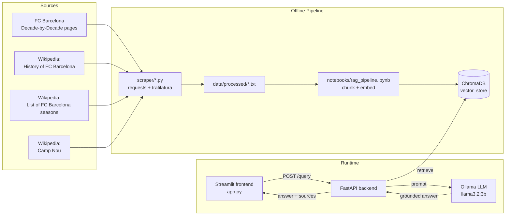
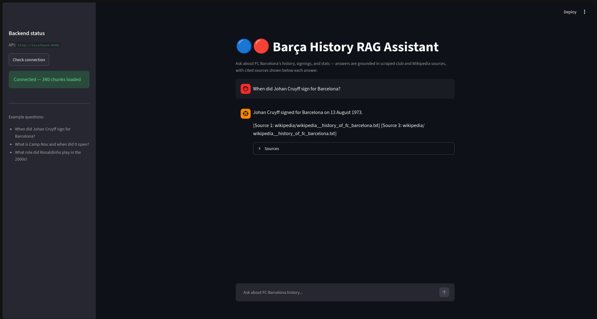

# Barça History RAG Assistant

A Retrieval-Augmented Generation (RAG) web application that answers questions about **FC Barcelona's history, signings, and season-by-season stats**, grounded in scraped official club and Wikipedia sources — built as a Level 2 Summer Training graduation project (Core Track).

> Ask "When did Johan Cruyff sign for Barcelona?" and get a cited, grounded answer instead of a guess.

## Overview

This project builds a complete pipeline from raw web sources to a deployed, working RAG application:

1. **Scrape** FC Barcelona's official "Decade by Decade" history pages and three Wikipedia articles.
2. **Clean, chunk, and embed** the text in a Jupyter notebook, storing the embeddings in a persisted ChromaDB vector store.
3. **Retrieve and generate** grounded, cited answers using a local Ollama LLM.
4. **Serve** the pipeline via a FastAPI backend.
5. **Chat** with the assistant through a Streamlit frontend.

Everything runs locally — no external API keys or paid services required, beyond the one-time download of the embedding and Ollama models.

## Architecture



## Tech Stack

| Layer | Choice |
|---|---|
| Scraping | `requests`, `beautifulsoup4`, `trafilatura` |
| Notebook | Jupyter |
| Chunking | Custom paragraph-aware chunker with sentence-level fallback |
| Embeddings | `sentence-transformers` (`all-MiniLM-L6-v2`) |
| Vector store | ChromaDB (persisted to disk, cosine similarity) |
| LLM | Ollama, local (`llama3.2:3b`) |
| Backend | FastAPI + Uvicorn |
| Frontend | Streamlit |

## Project Structure

```
barca-rag-assistant/
├── README.md
├── .gitignore
├── notebooks/
│   └── rag_pipeline.ipynb        # scrape-to-eval pipeline notebook
├── scraper/
│   ├── scrape_fcb_history.py     # FC Barcelona decade-by-decade pages
│   ├── scrape_wikipedia.py       # 3 Wikipedia sources
│   └── clean_text.py             # cleans + consolidates into data/processed/
├── data/
│   ├── raw/                      # scraped HTML/text, per source
│   ├── processed/                # cleaned text, ready for chunking
│   └── vector_store/             # persisted ChromaDB store + config.json
├── backend/
│   ├── app/
│   │   ├── main.py                # FastAPI app, CORS, lifespan startup
│   │   ├── api/routes/query.py    # GET /health, POST /query
│   │   ├── core/config.py         # .env settings + vector store config
│   │   ├── schemas/query.py       # request/response models
│   │   ├── services/
│   │   │   ├── retrieval.py       # loads Chroma, retrieves chunks
│   │   │   └── generation.py      # builds prompt, calls Ollama
│   │   └── utils/logging_config.py
│   ├── data/vector_store/         # copy of the notebook's persisted store
│   ├── tests/test_query.py
│   ├── requirements.txt
│   ├── .env.example
│   └── Dockerfile
└── frontend/
    ├── app.py                     # Streamlit chat UI
    ├── api_client.py              # wrapper for calling the backend
    ├── .env.example
    └── requirements.txt
```

## Domain & Data

**Domain:** FC Barcelona club history — founding, key signings, trophies, and stadium history, from 1899 to the present.

**Sources (16 documents total, ~180KB of text):**

| Source | Pages | What it covers |
|---|---|---|
| [FC Barcelona official history](https://www.fcbarcelona.com/en/club/history/decade-by-decade) | 13 (one per decade, 1899–2021) | Narrative decade-by-decade club history |
| [Wikipedia: History of FC Barcelona](https://en.wikipedia.org/wiki/History_of_FC_Barcelona) | 1 | Full prose history |
| [Wikipedia: List of FC Barcelona seasons](https://en.wikipedia.org/wiki/List_of_FC_Barcelona_seasons) | 1 | Season-by-season results and trophies |
| [Wikipedia: Camp Nou](https://en.wikipedia.org/wiki/Camp_Nou) | 1 | Stadium history and facts |

All sources are static, text-extractable HTML — no OCR was required. See `notebooks/rag_pipeline.ipynb` section 2.1 for the full data inventory.

## Setup

### Prerequisites

- Python 3.10+
- [Ollama](https://ollama.com) installed, with a model pulled: `ollama pull llama3.2:3b`
- Git

### 1. Build the vector store (one-time)

```bash
python -m venv .venv
source .venv/bin/activate
pip install jupyter pandas numpy chromadb sentence-transformers pypdf ollama python-dotenv requests beautifulsoup4 lxml trafilatura

python scraper/scrape_fcb_history.py
python scraper/scrape_wikipedia.py
python scraper/clean_text.py

jupyter nbconvert --to notebook --execute --inplace notebooks/rag_pipeline.ipynb
```

This populates `data/processed/` and `data/vector_store/`.

### 2. Backend

```bash
cd backend
cp .env.example .env
pip install -r requirements.txt

mkdir -p data/vector_store
cp -r ../data/vector_store/* data/vector_store/

uvicorn app.main:app --reload
```

Visit `http://localhost:8000/docs` to test `/query` interactively.

### 3. Frontend

In a separate terminal, with the backend still running:

```bash
cd frontend
cp .env.example .env
pip install -r requirements.txt

streamlit run app.py
```

Visit `http://localhost:8501` and start asking questions.

## Environment Variables

**`backend/.env`**

| Variable | Default | Description |
|---|---|---|
| `VECTOR_STORE_DIR` | `data/vector_store` | Path to the persisted Chroma store (resolved relative to `backend/`) |
| `RETRIEVAL_K` | `4` | Number of chunks retrieved per question |
| `CORS_ALLOWED_ORIGINS` | `http://localhost:8501` | Comma-separated list of allowed frontend origins |
| `LOG_LEVEL` | `INFO` | Logging verbosity |

**`frontend/.env`**

| Variable | Default | Description |
|---|---|---|
| `API_BASE_URL` | `http://localhost:8000` | URL of the FastAPI backend |

## API Reference

### `GET /health`

Returns whether the vector store loaded successfully and how many chunks it holds.

```bash
curl http://localhost:8000/health
```

```json
{
  "status": "ok",
  "vector_store_loaded": true,
  "total_chunks": 340
}
```

### `POST /query`

Retrieves relevant chunks, builds a grounded prompt, and calls the local LLM.

```bash
curl -X POST http://localhost:8000/query \
  -H "Content-Type: application/json" \
  -d '{"question": "When did Johan Cruyff sign for Barcelona?"}'
```

```json
{
  "answer": "Johan Cruyff signed for Barcelona on August 13, 1973.",
  "sources": [
    "fcbarcelona__1969-78-cruyff-and-democracy.txt",
    "wikipedia__history_of_fc_barcelona.txt"
  ]
}
```

Invalid input (missing `question`) returns `422 Unprocessable Entity`.

## Evaluation Results

Full detail lives in `notebooks/rag_pipeline.ipynb` section 2.6. Summary: **9/10** test questions answered correctly and grounded in retrieved context, spanning founding, signings, wars, eras, trophies, and stadium history.

The one failure is a genuinely interesting case, not a simple bug: asked "When did Barcelona win their first European Cup?", the model at `k=4` correctly reported insufficient information. At `k=6`, the correct source document *was* retrieved — but the model still answered with the wrong trophy (1979 Cup Winners' Cup instead of the 1992 European Cup), conflating two distinct Barça European titles. This is documented in the notebook as a **model reasoning limitation rather than a pure retrieval-recall problem**, along with mitigation ideas (tighter grounding prompts, larger chunk overlap around trophy names, entity disambiguation for multi-instance questions).

## Screenshots

**Frontend in action** — a real query answered end-to-end (frontend → backend → retrieval → Ollama → grounded, cited answer):



## Demo
- This is a steamlit deployed app demo that can be accessed when running the backend first https://barca-rag-assistant.streamlit.app/.
